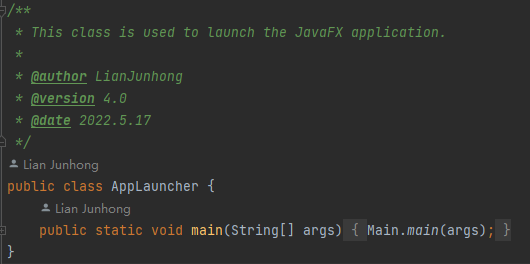

# EBU6304_G058_flight


EBU6304 – Software Engineering Group Project

**Last Modified Date: 2022-05-16.**

## Table of Contents

[TOC]

## Project Introduction

Our team will develop a **smart flight check-in kiosk software** for British Airways in a few weeks using **agile methods**. We will conduct a systematic requirements survey, analysis and design, followed by writing implementation and testing of the software. We will deliver **four major iterations** in a planned manner.


## Features

- Passengers look for their own booking information.
- Passengers choose seats.
- Passengers choose meals.
- Passengers can check in.
- Passengers can print tags.
- Administrator can login.
- Administrator can view all the passengers' information.


------


## Quick Start : How to run our project

**§§	jdk 17 and Maven 3.8.1 are required	**

1. #### **Use IDE**

   

   Our project was developed using **JetBrains IntelliJ IDEA** compiler. You can simply open this project folder in IDEA, wait for **Maven **to automatically complete the project build, and click the green triangle next to the application startup class **Main.java** to run it.

   

   

2. #### **Use the command line**

   

   Go to the project folder.

   Execute the command 	**mvn clean javafx:run**

   **For example:**

   ```powershell
   PS C:\Users\LianJunhong\Desktop> cd E:\Java\EBU6304_G058_flight
   PS E:\Java\EBU6304_G058_flight> mvn clean javafx:run
   ```

   Running result:

   ```powershell
   [INFO] Scanning for projects...
   [INFO]
   [INFO] ---------------------------< com.app:flight >---------------------------
   [INFO] Building fight 2.0
   [INFO] --------------------------------[ jar ]---------------------------------
   [INFO]
   [INFO] --- maven-clean-plugin:2.5:clean (default-clean) @ flight ---
   [INFO] Deleting E:\Java\EBU6304_G058_flight\target
   [INFO]
   [INFO] >>> javafx-maven-plugin:0.0.8:run (default-cli) > process-classes @ flight >>>
   [INFO]
   [INFO] --- lombok-maven-plugin:1.18.20.0:delombok (default) @ flight ---
   [INFO]
   [INFO] --- maven-resources-plugin:2.6:resources (default-resources) @ flight ---
   [INFO] Using 'UTF-8' encoding to copy filtered resources.
   [INFO] Copying 43 resources
   [INFO]
   [INFO] --- maven-compiler-plugin:3.8.1:compile (default-compile) @ flight ---
   [INFO] Changes detected - recompiling the module!
   [INFO] Compiling 40 source files to E:\Java\EBU6304_G058_flight\target\classes
   [INFO]
   [INFO] <<< javafx-maven-plugin:0.0.8:run (default-cli) < process-classes @ flight <<<
   [INFO]
   [INFO]
   [INFO] --- javafx-maven-plugin:0.0.8:run (default-cli) @ flight ---
   ```

   

   

3. #### **Use Jar or executable file**

   click **EBU6304_G058_flight.jar** to run the application.

   

   ------

   
## Requirements

- maven -- 3.8.1 
- jdk -- 17


## Documentation

Coming soon…


------

## Iteration logs

### 5.0 Beta (May 20, 2022) The Latest version

- Fixed the bugs in inputNumber.fxml and improve the code efficiency.
- Updated the Json and Csv files.
- Improved how to show the QR codes of baggage.
- Improved the interfaces.
- Fixed tableview bugs.
- Updated javadocs.
- Added unit test cases and automatic uitest cases.
- Updated CsvTest.
- Added the function of administrator login.
- Added the function of administrator view all the passengers' information.

### 4.5 RELEASE (May 16, 2022)

- Fixed several bugs.
- Added many test units.
- New page design of inputIdNumber.
- Updated javadocs.

### 4.5 Beta (May 13, 2022)

- Updated the seat price and get the price in Payment page.
- Updated the pay QR code.
- Added the boarding pass code and tag code in the last page.
- Fixed the bugs in implements.
- Improved the pages design.
- Fixed the bugs of codes and selecting seat.
- Updated validators.
- Added test units.
- Updated javadocs.

### 4.0 Beta (May 8, 2022)

- Several bugs fixed and new features added in this release.
- Separated printing function and created scanning function.
- Updated the help function and fastjson snapshot.
- Fixed bugs of Printer and Scanner.
- Update fastjson 2.0.2 fulling test of new dependency.
- Added the navigation map and showed the boarding gate in page.
- Improved the ScanInstructionController and show the video how to scan ID card to users.
- Improved Scanner to ues Runnable and Thread pool.
- Refactor SeatMapImpl with GetSeatMapImpl and SetSeatMapImpl.
- Added javadocs.

### 3.5 RELEASE (May 1, 2022)

- Added new features in this release.
- Fixed the bug of showing the retrieve information and beautify the page.
- Improved the interface of selecting food type.
- The interface logic of searching user information according to function selection was realized.
- The function of finding user interface was reconstructed.
- Fixed RetrieveController select passenger flight bugs.
- Improved the implementation of the interfaces.
- Adjusted the effect of printing boarding pass progress bar and added printer sound.
- Optimized thread synchronization.
- Fixed percentage showing during processing print the tags.
- Updated the Json and CSV files.
- Refactored to update fastjson1 to fastjson2 and fixed bugs.
- Added help page.
- Added several test units.
- Updated javadocs.

### 3.0 Beta (April 24, 2022)

- Several bugs fixed and new features added in this release.
- Fixed scene switching. Now the scene can be switched in the same window.
- Fixed the bug that the application will crash when the user select nothing but submit.
- The showSeatMap function has been refactored to reduce coupling.
- The interface logic of searching user information according to function selection is realized.
- The function of finding user interface is reconstructed.
- Updated CSV file to generate corresponding flight seating map based on flight ID.
- Added the ability to automatically generate passenger boarding cards.
- Improved front and back seating map compatibility.
- Many unit tests have been added to test our main functions.
- Added javadocs.

### 2.1 RELEASE (April 20, 2022)

- Several bugs fixed in this release.
- New features added in this release.
- New view of seat selection.
- Updated javadocs.

### 2.0 Beta (April 17, 2022)

- Further improved the basic functions of our page and realize the closed loop of basic operation logic.
- Integrated the administrator login function page.
- Implemented the display of flight information (in the form of a list) and passenger selection of seats and meals.
- Several bugs fixed in this release.
- Added javadoc.

### 1.5 (April 12, 2022)

- Fixed bugs and complete the iteration of the 1.0 version.
- Finished the pages and complete the functions of booking and retrieve information.
- Changed the design of flight and booking CSV data regardless of whether a passenger has more than one booking and
  flight.
- Implemented the GetFlight and GetReservation interface and GetFlightImpl and GetReservationImpl class.
- Updated javadocs.

### 1.0 (March 28, 2022)

- Completed the first page about selecting a language.
- Made entity classes about version 1.0.
- Completed the programming of common tools related to CSV and JSON.
- Completed the design of the interface between boundary class and control class.
- Completed the login interface design and the implementation of the login function.
- Added javadoc.

 ### 0.5 (March 21, 2022)

- Finally determined 28 user stories and acceptance criteria.
- Completed product prototype design using Axure.
- Completed the priority and Fibonacci story points （first version）.

 ### 0.1 (March 15, 2022)

- Set up the QMPlus Hub group and discuss the project handout.
- Discussed and wrote user stories focus on more specific and quantifiable details.
- Built project framework.

   

   

------


## Credits

   We would first like to thank **Queen Mary University** and **Beijing University of Posts and Telecommunications** for the joint training program that provided much needed guidance and assistance for this course project.
   Secondly, please allow us to express our sincere gratitude to **JetBrains** for providing free individual licenses for students and teachers to learn programming with its best-in-class development tools.
